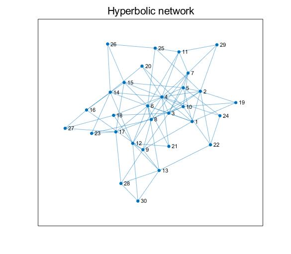

# 데이터가 사는 그래프: 그래프 이론의 소개   

Author: Hyekyoung Lee (Seoul National University Hospital) <br/>
Updated 20 August 2019 <br/>

# Analysis plan 

<ul> 
  <li> Step 1: [Generating artificial complex networks](#-Generating-artificial-complex-networks) </li> 
  <li> Step 2: <a href="# Visualizing artificial complex networks">Visualizing artificial complex networks</a> </li> 
  <li> Step 3: <a href="# Calculating complex network measures">Calculating complex network measures such as centrality, degrees, modularity, and small-worldness </a></li> 
  <li> Step 4: <a href="# Comparing the complex network measures">Comparing the complex network measures of different complex networks </a> </li> 
</ul> 
  
    

# Generating artificial complex networks 

Download: You can download the matlab toolbox for the generation of artificial complex networks 
made by Gregorio Alanis-Lobato <a href="https://se.mathworks.com/matlabcentral/fileexchange/45734-cnm">here</a>  <br/>

```Matlab
% demo_generation.m 
clear all 

% cnm toolbox should be in current folder
addpath('.\cnm');  
% the name of networks we generate 
network_name = {'Regular network','Small world network','Random network', ... 
    'Scale free network','Hyperbolic network'};

% number of nodes in a network 
p = 30;
% ratio of the number of connected edges to the number of all possible edges 
sparsity = 0.2; 
% number of all possible edges 
q = p*(p-1)/2; 
% number of neareast neigbors to which each node is connected 
k = round(q*sparsity*2/p); 
% power law scaling exponent of the network's node degree distribution
gamma = 4; 
% network temperature that allows for clustering tuning
T = 0.1; 

%%% Step 1: Generating artificial complex networks 
% Regular network 
RE = regular_net('N',p,'k',k); 
% Small world network 
SW = sw_net('N',p,'k',k); 
% Random network 
RA = er_net('N',p,'P',sparsity);
% Scale free network 
SF = ba_net('N',p,'m',round(k/2));
% Hyperbolic geometric network
HY = h2_net('N',p,'ave_deg',k,'gamma',gamma,'T',T,'plot','no'); 
```

# Visualizing artificial complex networks 

<b> Visualizing SF using MATLAB built-in functions </b> <br/> 
(You can find an example provided by MathWorks <a href="https://www.mathworks.com/help/matlab/ref/matlab.graphics.chart.primitive.graphplot.layout.html">here</a>.) 

```Matlab
% demo_generation.m continued 
% Step 2: Visualizing SF
[row,col] = find(SF); % find the index of nodes of connected edges (row,col) in SF  
tind = find(row < col); % because SF is a symmetric matrix 
row = row(tind); col = col(tind); 
G = graph(row,col); 

figure; 
h = plot(G,'Layout','force'); 
layout(h,'force','UseGravity',true,'Iterations',1000); 
title(network_name{5}); 
set(gca,'FontSize',14); 
```



You can plot the other networks in the same way. <br/> 
<br/>

<b> Visualizing RE, SW, and RA by varying sparsity </b> <br/> 

```Matlab
% demo_varyingsparsity.m 
clear all 

% cnm toolbox should be in current folder
addpath('.\cnm');  
% the name of networks we generate 
network_name = {'Regular network','Small world network','Random network'}; 

% number of nodes in a network 
p = 30;
% number of all possible edges 
q = p*(p-1)/2; 

% Plot RE, SW, and RA by varying sparsity 
figure; 
for s = 1:10, 
    % ratio of the number of connected edges to the number of all possible edges 
    sparsity = s*0.1; 
    % number of neareast neigbors to which each node is connected 
    k = round(q*sparsity*2/p); 

    % Step 1: Generating networks 
    % Regular network 
    RE = regular_net('N',p,'k',k); 
    % Small world network 
    SW = sw_net('N',p,'k',k); 
    % Random network 
    RA = er_net('N',p,'P',sparsity);

    % Step 2: Visualizing networks
    for i = 1:3, 
        if i == 1,
            net = RE; 
        elseif i == 2,
            net = SW; 
        else
            net = RA; 
        end 
        
        [row,col] = find(net); % find the index of nodes of connected edges (row,col) in SF  
        tind = find(row < col); % because SF is a symmetric matrix 
        row = row(tind); col = col(tind); 
        G = graph(row,col);
        subplot(3,10,(i-1)*10+s); 
        h = plot(G,'Layout','force'); 
        layout(h,'force','UseGravity',true,'Iterations',1000); 
        
        if s == 5, 
            title(network_name{i});
        end 
        if i == 3, 
            xlabel(['sparsity=' num2str(sparsity)]); 
        end 
        set(gca,'FontSize',14); 
    end
end
```


# Calculating complex network measures 

# Comparing the complex network measures


  
